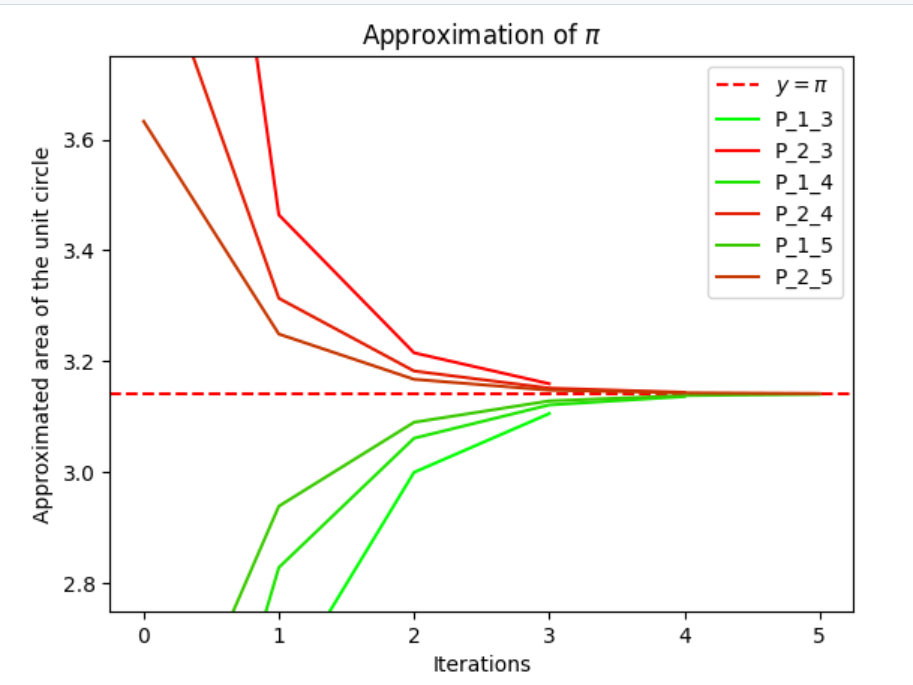
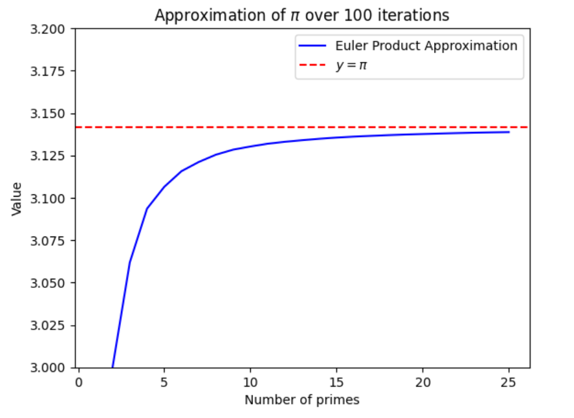

# About

Maths and coding write ups of different topics I've come across in class or myself and found interesting: 

- `algorithms-and-ds.py`: graphs (Dijkstra's, Bellman-Ford, Ford-Fulkerson) and Fenwick tree implementation.
  
- `approximating-pi.ipynb`: approximating $\pi$ using the areas of inscribed and circumscribed polygons.
  
  # Figure 1: areas of inscribed (green) and circumscribed (red) polygons of a unit circle and different side lengths. 
- `euclidean-algorithm.ipynb`: proving the Euclidean algorithm works, deriving the time complexity using Fibonnaci numbers, and implementing Bezout's lemma in python. 
- `euler-product-formula.ipynb`: deriving P(gcd(a,b)=1)=6/pi^2 and proving the Basel problem including proofs by Fourier series, trigonometry and exploiting circles.
  
  
- `proof-assistant-essay`: my essay for the Caius Explore on the proof assistant Coq.
